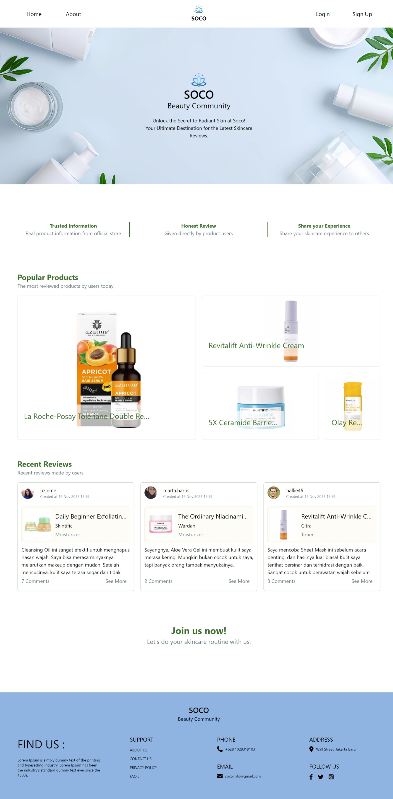
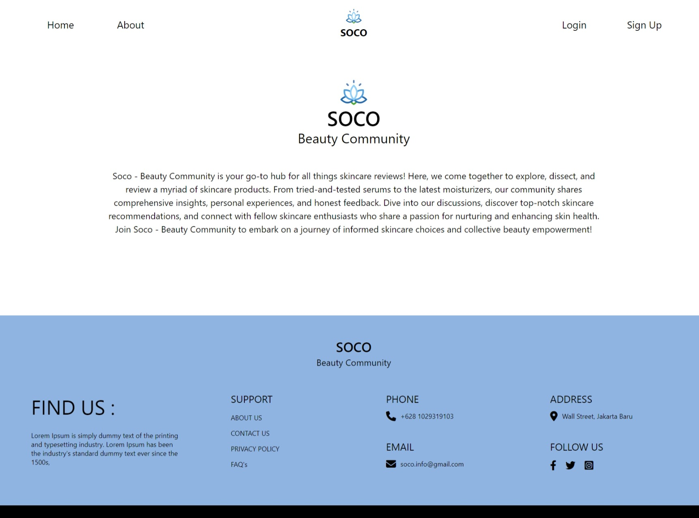
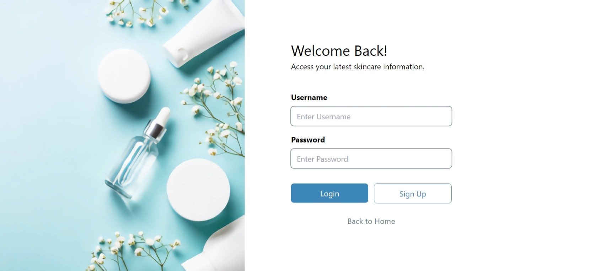

<h1 align="center">
  
 SOCO   
 Beauty Community
</h1>

# Daftar Isi
- <a href="#deskripsi"> Deskripsi </a>
- <a href="#fitur"> Fitur </a>
- <a href="#tampilan-website"> Tampilan Website </a>
    - [Halaman Landing](#1-halaman-landing)
    - [Halaman About](#2-halaman-about)
    - [Halaman Login](#3-halaman-login)
    - [Halaman Sign Up](#4-halaman-sign-up)
    - [Halaman Home - User](#5-halaman-home---user)
    - [Halaman Detail Review - User](#6-halaman-detail-review---user)
    - [Halaman Pilih Produk - User](#7-halaman-pilih-produk---user)
    - [Halaman Tambah Review - User](#8-halaman-tambah-review---user)
    - [Halaman Produk - User](#9-halaman-produk---user)
    - [Halaman Detail Produk - User](#10-halaman-detail-produk---user)
    - [Halaman Profile - User](#11-halaman-profile---user)
    - [Halaman Edit Profile - User](#12-halaman-edit-profile---user)

# Deskripsi

Soco - Beauty Community adalah website komunitas sosial yang berjalan di bidang kecantikan. Website ini bisa diakses oleh siapa pun dan digunakan untuk mencari informasi terkait produk-produk perawatan kulit, seperti toner, serum, moisturizer, dan lain-lain. Tujuan utama dari penggunaan website ini adalah memungkinkan user untuk dapat mengulas produk-produk perawatan kulit (skincare) yang telah mereka gunakan sebelumnya sehingga dapat memberikan informasi baru kepada user lainnya terkait penggunaan produk yang sedang diulas.

# Fitur

Pada website ini terdapat dua macam jenis akun, yakni User dan Admin. Terdapat perbedaan fitur yang dapat digunakan oleh kedua tipe akun ini, antara lain:

### Admin
- Admin dapat menambahkan data produk pada website.
- Admin dapat melihat data produk pada website.
- Admin dapat mengubah data produk pada website.
- Admin dapat menghapus data produk dari website.
- Admin dapat melihat data user yang terdaftar pada website.
- Admin dapat melihat ulasan dan komentar yang ditambahkan oleh user.

### User
- User dapat menambahkan ulasan (review) dan komentar pada website.
- User dapat melihat ulasan dan komentar pada website.
- User dapat menghapus ulasan dan komentar miliknya pada website.
- User dapat melihat data produk pada website.
- User dapat melihat data akun pada website.
- User dapat mengubah data akun pada website.

# Tampilan Website

### 1. Halaman Landing 

Halaman ini adalah tampilan awal yang akan ditampilkan kepada user sebelum melakukan login. Struktur dari halaman ini terdiri dari header yang memiliki 4 macam menu, yaitu Home, About, Login, dan Sign Up. Pada bagian konten, diperkenalkan slogan dari website dan kelebihan-kelebihan dari penggunaan website kepada user. Selain itu, ditampilkan juga sekilas produk-produk terpopuler yang telah diulas dan ulasan-ulasan terkini yang dibuat oleh user yang telah terdaftar. Pada bagian bawah, terdapat footer yang menampilkan beberapa kontak website yang dapat dihubungi.

### 2. Halaman About

Pada halaman About, ditampilkan logo dari Soco - Beauty Community beserta deskripsi singkat yang menggambarkan website secara umum.

### 3. Halaman Login

Halaman Login terdiri dari 2 macam input yang dapat diisi oleh user, yaitu username dan password. Akun user dan admin menggunakan halaman ini bersama-sama sebelum akhirnya masuk ke dalam website. Pada halaman ini tersedia 3 macam tombol, yakni tombol Login untuk melakukan login, tombol Sign Up untuk mengarahkan user ke Halaman Sign Up agar dapat menambahkan akun baru, dan tombol Back to Home untuk kembali ke Halaman Landing.

### 4. Halaman Sign Up

Halaman Sign Up terdiri dari 5 macam input yang bisa diisi oleh user, yaitu Foto Profil untuk mengunggah gambar sebagai foto, Username untuk membuat username yang harus unik, Full Name untuk memasukkan nama lengkap user, serta Password dan Confirm Password untuk memasukkan Password yang ingin digunakan. Pengisian kolom input Password dan Confirm Password harus sama agar proses registrasi berhasil. Sama halnya dengan Halaman Login, pada halaman ini terdapat 3 macam tombol, yaitu Login yang akan megarahkan user ke Halaman Login, tombol Sign Up untuk melakukan registrasi, dan tombol Back to Home untuk kembali ke Halaman Landing.

### 5. Halaman Home - User

Halaman Home untuk User menampilkan ulasan-ulasan yang telah dibuat oleh berbagai user yang telah terdaftar. Pada halaman ini user bisa mencari ulasan yang diinginkan dengan memasukkan kata kunci terkait ulasan tersebut pada kolom pencarian. Untuk melihat ulasan yang hanya dibuat oleh user tersebut, user dapat menekan sub menu My Reviews.

### 6. Halaman Detail Review - User
 
Pada Halaman Detail Review, user bisa melihat ulasan dengan lengkap. Di sini, user bisa menambahkan komentar baru terkait ulasan yang sedang dilihat dan melihat komentar-komentar yang telah ditambahkan oleh user lain.

### 7. Halaman Pilih Produk - User

Halaman ini ditampilkan pada saat user ingin mengulas suatu produk. Untuk bisa membuat ulasan, user diharuskan untuk memilih salah satu produk yang ingin diulas. User bisa menggunakan kolom pencarian produk agar dapat dengan mudah menemukan produk yang diinginkan.

### 8. Halaman Tambah Review - User

Halaman Tambah Review terdiri dari deskripsi singkat dari produk yang akan diulas dan kolom input untuk memasukkan ulasan yang ingin dimasukkan. Apabila telah selesai dan ingin mengirimkan ulasan, user bisa menekan tombol submit.

### 9. Halaman Produk - User

Halaman Produk menampilkan produk-produk yang dapat diulas. Pada bagian sidebar terdapat sub menu yang bisa menampilkan produk-produk berdasarkan jenisnya, yaitu Facial Wash, Toner, Serum, Moisturizer, dan Sunscreen. Untuk melihat detail produk, user bisa menekan salah satu produk yang nantinya akan diarahkan ke Halaman Detail Produk.

### 10. Halaman Detail Produk - User

Halaman Detail Produk pada tipe akun User menampilkan nama produk, merk produk, jenis produk, dan deskripsi dari produk. Apabila user ingin melihat ulasan-ulasan terkait dengan produk yang dilihat, maka user bisa menekan tombol Show All Reviews. Apabila user ingin menambahkan ulasan terkait produk, maka user bisa menekan tombol Add Review.

### 11. Halaman Profile - User

Halaman Profile pada akun User menampilkan data akun user, seperti username, nama lengkap, dan tanggal bergabung dengan website. Di sini juga diperlihatkan total review dan komentar yang telah ditambahkan oleh akun. Ditampilkan juga review-review yang telah dibuat oleh akun.

### 12. Halaman Edit Profile - User

Halaman Edit Profile menampilkan formulir yang hampir sama pada Halaman Sign Up. Perbedaannya terletak pada kolom input New Password yang bisa diisikan apabila ingin mengganti password akun.
